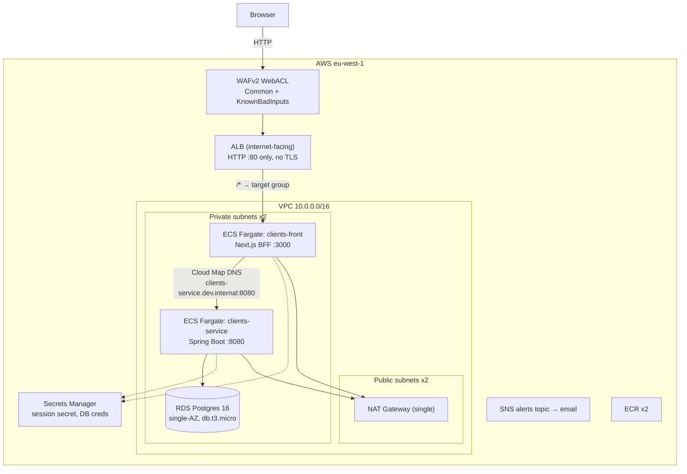
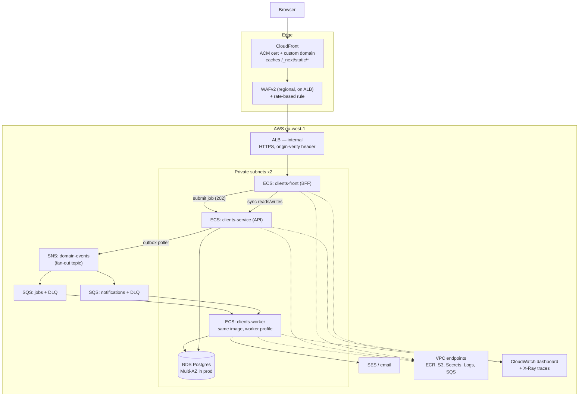
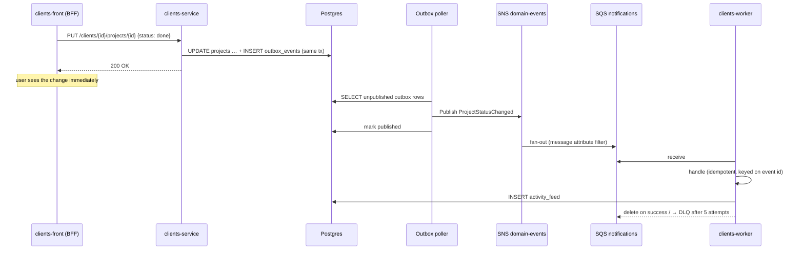
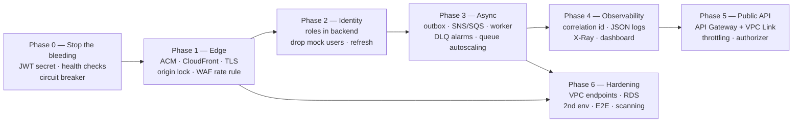

# Architecture improvements

Cross-repo architecture review for the `clients` system (`clients-infra`, `clients-service`,
`clients-front`), written 2026-08-16 against the state of all three repos on `main`.

This document is the **shared** architecture doc: it describes where the system is today, what's
missing, and what the target should look like. It deliberately contains no step-by-step tasks —
those live in the per-repo implementation plans:

- `clients-infra/docs/IMPLEMENTATION_PLAN.md` (AWS / CloudFormation workstream)
- `clients-service/docs/IMPLEMENTATION_PLAN.md` (Spring Boot workstream)
- `clients-front/docs/IMPLEMENTATION_PLAN.md` (Next.js workstream)

Existing docs stay authoritative for what already exists: `clients-service/docs/ARCHITECTURE.md`
describes the backend as built, and each repo's `docs/PLAN.md` tracks its own in-flight work.

**Optimization target for this review: portfolio showcase.** Recommendations favour patterns that
are visible, explainable in an interview, and honest about their tradeoffs, while keeping the `dev`
AWS bill small. Where a "resume-friendly" choice would be architecturally wrong for this system,
that is called out rather than papered over.

---

## 1. Current state

### 1.1 Topology as deployed (`dev`, eu-west-1)

### 1.2 What is genuinely good already

Worth stating plainly, because the improvements below should not be read as "this is bad":

- **The BFF boundary is correct.** `clients-service` is not internet-facing, the browser never
  holds a backend token, and reachability is enforced by security-group references rather than CIDR
  ranges. Most portfolio projects expose the API publicly and bolt CORS on; this one doesn't.
- **Schema ownership is correct.** Flyway owns DDL, Hibernate is `validate`-only.
- **Stack decomposition is clean.** One template per concern, cross-linked only through
  `Fn::ImportValue` on `${Environment}-*` exports, so any stack redeploys independently.
- **The CI/CD ownership split is deliberate and documented** — infra CI never touches the ECS
  service stacks the app repos force-redeploy, avoiding a real race.
- **Auth is real**, not mocked: BCrypt, HS256, a custom filter wired as a `@Bean` (with the
  `@WebMvcTest` slice reasoning documented), RFC 7807 error bodies with no user enumeration.
- **Alarms exist and route somewhere a human reads**, and both ECS services have target-tracking
  autoscaling.

The gaps below are the difference between "a well-built dev environment" and "a system that would
survive a production readiness review".

### 1.3 Gap register

Severity is *impact if this system took real traffic*, not "how bad is the code".

| # | Gap | Severity | Where |
|---|-----|----------|-------|
| G1 | Backend runs with the **dev-only default JWT signing secret** — `SECURITY_JWT_SECRET` is never injected by the task definition | **Critical** | `clients-infra/templates/service-clients-service.yaml` |
| G2 | **No TLS**: ALB is HTTP :80 only, so `secure: true` session cookies are never sent by the browser — auth is effectively broken over the deployed URL | **Critical** | `alb.yaml`, `clients-front/lib/session.ts`, `lib/api/http.ts` |
| G3 | **The frontend ALB is the public entry point**, with no CDN, no edge caching, and static Next.js assets served from Fargate | High | `alb.yaml`, `service-clients-front.yaml` |
| G4 | **Identity is split-brain**: role/name/clientId come from `lib/mock-data/users.ts` in the frontend, while the backend `User` only knows email+password. A backend account without a frontend profile entry cannot log in | High | `clients-front/lib/mock-data/users.ts`, `clients-service` `auth/` |
| G5 | **No ECS container health checks.** Fargate ignores the Dockerfile `HEALTHCHECK`; `clients-service` has `HealthCheckCustomConfig` only, so Cloud Map advertises a task that is running but not ready | High | both `service-clients-*.yaml` |
| G6 | **Everything synchronous.** No queue, no async work, no retry/DLQ semantics anywhere | High | system-wide |
| G7 | **Session lifetime mismatch**: 7-day app session cookie vs 1-hour backend JWT, no refresh, no revocation → silent `ApiError(401)` mid-session | High | `clients-front/lib/session.ts`, `clients-service` `JwtService` |
| G8 | **No deployment circuit breaker / rollback** on either ECS service — a broken image rolls out and stays | High | both `service-clients-*.yaml` |
| G9 | **Single NAT Gateway is a hard SPOF** and carries all ECR/Secrets Manager/CloudWatch traffic; no VPC endpoints | Medium | `network.yaml` |
| G10 | **No distributed tracing or correlation IDs** — a request crossing browser → front → back → RDS cannot be followed | Medium | system-wide |
| G11 | **No structured (JSON) logging**; Container Insights disabled; no dashboard | Medium | `ecs-cluster.yaml`, both apps |
| G12 | **Frontend types duplicate backend DTOs by hand** (`lib/types/*.ts`) despite a live OpenAPI 3.1 spec being generated — no contract test, drift is silent | Medium | `clients-front/lib/types`, `clients-service` springdoc |
| G13 | **Task roles have zero policies.** Both `TaskRole`s exist but grant nothing, so no AWS API call from app code is currently possible | Medium | both `service-clients-*.yaml` |
| G14 | **No rate limiting anywhere** — WAF has no rate-based rule, no per-account throttling on login | Medium | `waf.yaml`, `clients-service` |
| G15 | **Single environment.** `dev` only; no `qa`/`prod`, and the Makefile hardcodes `config/dev.env` | Medium | `clients-infra/Makefile` |
| G16 | **RDS is single-AZ, 1-day backups, no deletion protection, no Performance Insights**, and the master credential is used directly by the app with no rotation | Medium | `rds.yaml` |
| G17 | **No E2E tests and no load test.** Backend has good unit/slice coverage, frontend has Vitest, but nothing exercises browser → front → back | Medium | system-wide |
| G18 | **Infra CI validates syntax only** (`aws cloudformation validate-template`) — no `cfn-lint`, no policy scanning, no change-set preview before deploy | Low | `.github/workflows/deploy-infra.yml` |
| G19 | **ECR has no image scanning**, mutable tags, and no lifecycle rule for tagged images | Low | `ecr.yaml` |
| G20 | **No optimistic locking / concurrency control** on entities; last write wins on concurrent edits | Low | `clients-service` entities |
| G21 | **No ECS Exec** enabled, so debugging a live task requires a redeploy | Low | both `service-clients-*.yaml` |

G1 and G2 are the two findings worth acting on regardless of anything else in this document.

---

## 2. Target architecture

Changes from today, in one line each:

1. **CloudFront becomes the only public entry point**; the ALB moves to `internal` (or stays
   internet-facing but only accepts requests carrying a secret origin header from CloudFront).
2. **TLS end-to-end** via ACM + a custom domain, which unblocks `Secure` cookies and HSTS.
3. **An event backbone**: `clients-service` publishes domain events through a transactional outbox
   to SNS, which fans out to per-consumer SQS queues, each with a DLQ.
4. **A worker service** (`clients-worker`) consumes those queues — same repo and image as
   `clients-service`, different Spring profile, separate ECS service so it scales independently on
   queue depth rather than CPU.
5. **Identity consolidates into the backend**: role, display name and `clientId` become columns on
   `User` and claims in the JWT; the frontend's mock user table disappears.
6. **Observability**: JSON logs with a correlation ID propagated front → back → worker, X-Ray
   tracing, Container Insights, one CloudWatch dashboard, alarms on DLQ depth and message age.

---

## 3. Decision: what "API gateway" should mean here

The stated goal was *"an API gateway that calls the front, so the front isn't exposed directly."*
That goal is right; the component that best delivers it is worth choosing deliberately, because
"API Gateway" (the AWS product) is not automatically the answer for a server-rendered app.

### 3.1 Option A — CloudFront in front of an internal ALB

CloudFront terminates TLS at the edge, serves `/_next/static/*` and `/public/*` from cache, and
forwards everything else to the ALB. The ALB either becomes `Scheme: internal` and is reached via a
**CloudFront VPC origin**, or stays internet-facing with a listener rule that 403s any request
missing a secret `X-Origin-Verify` header held in Secrets Manager.

| | |
|---|---|
| Cost | ~$0–2/mo at portfolio traffic (1 TB free tier egress) |
| Fixes | G2 (TLS), G3 (CDN + front not directly reachable), partially G14 (edge WAF) |
| Strength | The correct pattern for an SSR/BFF app. Real latency win, real cost win, custom domain. |
| Weakness | Not a "gateway" in the API-management sense: no usage plans, no per-route auth, no request/response transformation. |

### 3.2 Option B — API Gateway HTTP API + VPC Link → internal ALB

API Gateway becomes the public entry, VPC Links into the private subnets, and proxies to the ALB.

| | |
|---|---|
| Cost | ~$1/M requests + ~$0.01/hr per VPC Link ≈ $7–8/mo idle |
| Fixes | G2, G3 (front not directly reachable), G14 (throttling built in) |
| Strength | It is literally AWS API Gateway; gives throttling, usage plans, JWT authorizers, per-route config, request validation. Strong keyword for a resume. |
| Weakness | **Poor fit for full-page HTML and asset delivery**: 10 MB payload cap, 30 s integration timeout, no caching on HTTP APIs (only REST APIs, at ~$14/mo), and it adds a hop of latency to every page render. It is designed to front APIs, not Next.js. |

**The honest read:** putting API Gateway in front of `clients-front` would be an architectural
mistake dressed as a best practice, and a sharp interviewer will say so. API Gateway earns its place
in this system in a different position — see 3.4.

### 3.3 Option C — Spring Cloud Gateway as an ECS service

A new Java service behind the ALB routes `/` to `clients-front` and `/api/**` to `clients-service`,
centralising JWT validation, rate limiting (Redis or in-memory), circuit breaking (Resilience4j),
and request logging.

| | |
|---|---|
| Cost | +1 Fargate task ≈ $9–12/mo, plus operational ownership |
| Fixes | G3 (front not directly reachable), G14, and gives one place for cross-cutting concerns |
| Strength | The strongest *backend engineer* showcase of the three: real Spring code, filters, resilience patterns, service-to-service routing. |
| Weakness | Duplicates what the BFF already does (`clients-front` is already the sole edge for the API), adds a hop and a thing to keep alive, and validating JWTs in two places invites drift. Managed alternatives do the same job for less. |

### 3.4 Recommendation

**Do Option A now. Add Option B for a genuinely public API surface later. Treat Option C as a
deliberate learning exercise, not a system requirement.**

Concretely:

- **Phase 1 — CloudFront + ACM + custom domain, ALB restricted to CloudFront.** This is what
  actually satisfies "don't expose the front directly", and it fixes the broken-cookie bug as a side
  effect. Keep the regional WAF on the ALB (it protects the origin) and add a rate-based rule.
- **Phase 2 — introduce a *public* API, distinct from the BFF path, and put API Gateway HTTP API in
  front of that.** This is the version of the idea that holds up: `api.<domain>` → API Gateway →
  VPC Link → internal ALB → `clients-service`, with a JWT authorizer, per-route throttling and a
  usage plan. The browser keeps going through the BFF; a hypothetical third-party integrator goes
  through API Gateway. Now the gateway is fronting an API, which is what it's for, and the "don't
  expose the backend directly" property is preserved because API Gateway — not the ALB — is public.
- **Phase 3 (optional) — Spring Cloud Gateway**, if the goal is to demonstrate the Java side of
  gateway patterns. If it goes in, put it in front of `clients-service` (replacing the direct Cloud
  Map hop from the BFF), not in front of `clients-front`, and let it own rate limiting + circuit
  breaking so its existence is justified by behaviour the BFF doesn't already provide.

Recording the reasoning matters as much as the choice — see ADR-001 in §6.

---

## 4. Decision: what the queue actually decouples

The stated goal was *"a queue to decouple front and back."* The instinct is right, but the framing
needs one correction that is itself a good thing to be able to explain:

> **A queue cannot decouple a synchronous read.** When the admin page asks "list this client's
> projects", the user is waiting for the answer; routing that through SQS just adds latency and
> failure modes. Queues decouple *work that does not need to finish before the response*.

So the split is:

| Interaction | Stays synchronous | Goes async via SQS |
|---|---|---|
| List/read clients, phones, addresses, projects | ✅ | |
| Create/update/delete a single resource | ✅ | |
| Login / register | ✅ (token issuance) | ✉️ welcome email |
| Project status change | ✅ (the write) | ✉️ client notification, 📝 activity feed entry |
| Bulk CSV client import | 202 Accepted + job id | ✅ the whole import |
| Project report / data export | 202 Accepted + job id | ✅ generation + S3 upload |
| Audit trail of every mutation | | ✅ |

### 4.1 Chosen technology: SQS + SNS

Selected over Kafka/MSK and RabbitMQ/Amazon MQ:

| | SQS + SNS | MSK Serverless | Amazon MQ (RabbitMQ) |
|---|---|---|---|
| Idle cost at this scale | **~$0** (1 M requests/mo free) | ~$100+/mo | ~$25–30/mo (mq.t3.micro) |
| Ops burden | None | Cluster config, partitions, ACLs | Broker patching, HA pair |
| Spring integration | `spring-cloud-aws-starter-sqs`, `@SqsListener` | `spring-kafka` | `spring-boot-starter-amqp` |
| Fits the workload | Yes — task queues with retries | Overkill: no replay/stream-processing need | Yes, but pays for capability that isn't used |

At this system's volume and with "portfolio showcase, sane bill" as the target, SQS wins on every
axis except Kafka-specific résumé keywords. The patterns worth demonstrating — producer/consumer
decoupling, at-least-once delivery, idempotent consumers, DLQ + redrive, backpressure-based
autoscaling — are all demonstrable on SQS, and they're the patterns an interviewer actually probes.

### 4.2 Event flow design

Design commitments:

- **Transactional outbox, not "publish inside the service method".** Writing the domain event to an
  `outbox_events` table in the *same transaction* as the business write is what makes "the DB
  committed but SNS was down" impossible. This is the single most interview-valuable detail in the
  whole plan; it is also five tables' worth of work, not fifty.
- **SNS fan-out topic, not a queue per producer.** One `domain-events` topic; each consumer owns an
  SQS queue subscribed with a message-attribute filter policy. Adding a consumer never touches the
  producer.
- **Every queue has a DLQ** with `maxReceiveCount: 5`, plus CloudWatch alarms on
  `ApproximateNumberOfMessagesVisible` (DLQ > 0) and `ApproximateAgeOfOldestMessage` on the main
  queue, publishing to the existing `${Environment}-alerts-topic-arn`.
- **Consumers are idempotent**, keyed on the event UUID, because SQS standard queues are
  at-least-once. FIFO queues are *not* used: ordering isn't required, and FIFO's throughput and
  cost model buy nothing here.
- **The worker scales on queue depth**, via an Application Auto Scaling target-tracking policy on a
  `backlog per task` custom metric — a genuinely different scaling signal from the CPU/memory
  policies the two existing services use, and worth demonstrating for that reason alone.

### 4.3 Where the frontend touches the queue

Never directly. The BFF calls `POST /api/v1/imports` on `clients-service`, gets `202 Accepted` with
a job id and a `Location` header, and polls `GET /api/v1/imports/{id}` (or subscribes to a Server-
Sent Events stream, if the goal is to show that off). `clients-front` gets no AWS credentials and no
SQS permissions — the BFF boundary stays exactly where it is.

---

## 5. Other improvement themes

Detailed tasks are in the per-repo plans; this is the rationale.

### 5.1 Security

- **Inject `SECURITY_JWT_SECRET` from Secrets Manager** into the backend task definition (G1). The
  secret should be generated by the service stack the same way `clients-front`'s `SESSION_SECRET`
  already is. Until this lands, anyone who reads the public `application.properties` can mint valid
  tokens for the deployed environment.
- **TLS everywhere** (G2): ACM certificate, HTTPS listener, HTTP→HTTPS redirect, HSTS header from
  CloudFront. This is a prerequisite for `Secure` cookies to work at all.
- **Rate-limit authentication** (G14): a WAF rate-based rule scoped to `/login` and `/signup`, plus
  per-account lockout or exponential backoff in `AuthService`.
- **Scope the task roles** (G13): least-privilege policies for `sqs:SendMessage` (backend),
  `sqs:ReceiveMessage`/`DeleteMessage` (worker), `ses:SendEmail`, `xray:PutTraceSegments`.
- **Rotate secrets**: enable Secrets Manager rotation on the DB secret, and stop using the RDS
  master credential as the application credential — create a least-privilege app role in a Flyway
  migration.
- **Split the auth model**: add roles/authorities to the backend so `@PreAuthorize` can distinguish
  admin from client, instead of the frontend being the only thing that knows (G4).

### 5.2 Reliability

- **Container health checks in the task definitions** (G5) targeting `/actuator/health/readiness`
  and a new `/api/health` route on the frontend, with Spring Boot's liveness/readiness probe groups
  enabled so a task draining connections stops receiving traffic.
- **Deployment circuit breaker** (`DeploymentConfiguration.DeploymentCircuitBreaker` with
  `Rollback: true`) on both services (G8) — the single highest value-per-line change in the infra
  repo.
- **VPC endpoints** for ECR (api + dkr), S3, Secrets Manager, CloudWatch Logs and SQS (G9): removes
  the NAT Gateway from the critical path of every image pull and every log write, cuts NAT data
  charges, and makes the single-NAT SPOF much less scary. Interface endpoints cost ~$7/mo each, so
  pick the three that matter (ECR api/dkr + S3 gateway, which is free) rather than all of them.
- **RDS hardening** (G16): `DeletionProtection`, 7-day backups, Performance Insights, and a
  documented Multi-AZ flip for any non-dev environment.

### 5.3 Observability

- **Correlation ID end to end** (G10): the BFF generates an `X-Request-Id` per request, attaches it
  on every backend call, the backend puts it in the MDC and echoes it, the outbox carries it into
  the event payload so the worker logs under the same id.
- **JSON logging** on both services (Logback `JsonEncoder` / `pino`) so CloudWatch Logs Insights can
  query fields instead of regexing text (G11).
- **X-Ray or OpenTelemetry**: the ADOT sidecar on both ECS services gives a service map that shows
  browser → front → back → RDS → SQS → worker. This is the single most *demonstrable* observability
  artifact for a portfolio — a screenshot of the service map says more than any paragraph.
- **One CloudWatch dashboard** per environment: ALB request count/5xx/latency, ECS CPU/memory/task
  count per service, RDS connections/CPU, SQS depth/age/DLQ. Ship it as a `dashboard.yaml` stack.
- **Enable Container Insights** on the cluster (currently explicitly `disabled`).

### 5.4 Delivery and environments

- **Parameterise the Makefile by `ENV_FILE`** (G15) so `make deploy-all ENV=qa` works without
  duplicating targets, then stand up a second environment. Two environments is the point at which
  the `Fn::ImportValue` naming discipline actually pays off, and it makes the "promote an image
  between environments" story real.
- **Deploy by immutable tag, not `latest`.** Both app repos push `latest` + SHA and then
  force-redeploy; passing the SHA as `ImageTag` to the service stack makes rollback a redeploy of a
  known tag rather than an ECR retag.
- **`cfn-lint` + `cfn-guard`/Checkov in infra CI**, and a `make preview` target that renders a
  change set without executing it (G18).
- **ECR image scanning on push**, immutable tags, and a lifecycle rule that keeps the last N tagged
  images (G19).

### 5.5 Contract and testing

- **Generate the frontend API client from the OpenAPI spec** (G12). springdoc already publishes
  OpenAPI 3.1 at `/v3/api-docs`; `openapi-typescript` turns it into types at build time. This
  deletes the hand-maintained `lib/types/*.ts` duplication and turns backend/frontend drift into a
  compile error. A CI job that regenerates and fails on diff is the cheap contract test.
- **Playwright E2E** against the docker-compose stack in CI (G17): login → create client → add
  project → change status → see the activity feed entry produced by the worker. One happy path that
  crosses every component is worth more than broad shallow coverage.
- **A k6 or Gatling smoke load test** in CI, mostly so autoscaling and the alarms can be shown
  actually firing.

### 5.6 Deliberate non-goals

Worth listing so their absence reads as a decision, not an oversight:

- **No Kubernetes.** ECS Fargate is the right complexity level for two services and a worker; EKS
  would add a control plane bill and a lot of YAML to demonstrate nothing this system needs.
- **No service mesh.** Two internal hops don't justify App Mesh/Istio.
- **No microservice split.** `clients-service` is one well-factored modular monolith with two
  feature packages; splitting `auth` out would create a distributed transaction problem in exchange
  for nothing.
- **No caching tier (ElastiCache) yet.** There's no measured read hot spot. Add it when a dashboard
  shows one, and say so.
- **No GraphQL.** REST + a generated client covers the frontend's needs.

---

## 6. Architecture decision records

Short ADRs, so the reasoning survives past this document.

### ADR-001 — CloudFront is the public entry point; API Gateway fronts a future public API

**Status:** proposed · **Context:** the frontend ALB is directly internet-facing over plain HTTP.
**Decision:** put CloudFront + ACM in front and restrict the ALB to CloudFront; reserve AWS API
Gateway for a separate public `api.` surface fronting `clients-service` via VPC Link.
**Consequences:** TLS, CDN caching for Next.js static assets, custom domain, and `Secure` cookies
start working. API Gateway's payload/timeout limits never sit on the HTML path. Cost stays near
zero until the public API exists.
**Rejected:** API Gateway in front of the Next.js app (wrong tool for SSR/asset delivery);
Spring Cloud Gateway in front of the app (duplicates the BFF, adds a hop and a service to run).

### ADR-002 — SQS + SNS for asynchronous work; no Kafka

**Status:** proposed · **Context:** everything is synchronous; some work (email, exports, imports,
audit) doesn't belong in the request path. **Decision:** SNS `domain-events` topic fanning out to
per-consumer SQS queues, each with a DLQ, consumed by a `clients-worker` ECS service.
**Consequences:** ~$0 idle cost, no broker to run, standard Spring integration. Standard queues are
at-least-once so consumers must be idempotent; there is no replay or event-sourcing capability.
**Rejected:** MSK/MSK Serverless (cost and ops out of proportion to the need); Amazon MQ (pays for
AMQP features this workload doesn't use); in-process `@Async` (no durability, work lost on task
replacement).

### ADR-003 — Transactional outbox for event publication

**Status:** proposed · **Context:** publishing to SNS inside a service method can succeed while the
transaction rolls back, or vice versa. **Decision:** write events to an `outbox_events` table in the
business transaction; a scheduled poller publishes and marks them sent.
**Consequences:** at-least-once publication with no dual-write inconsistency; adds a table, a poller
and a small publication latency (poll interval). **Rejected:** direct publish (lost/phantom events);
CDC via DMS/Debezium (infrastructure far out of proportion).

### ADR-004 — Identity consolidates into `clients-service`

**Status:** proposed · **Context:** the frontend's `lib/mock-data/users.ts` is the only source of
role, display name and `clientId`; the backend `User` has email+password only, so a real backend
account can't log in without a matching mock entry. **Decision:** add `role`, `displayName` and
`clientId` to the backend `User`, emit them as JWT claims, delete the mock table, derive the
frontend session from the backend token. **Consequences:** one source of truth; `@PreAuthorize`
becomes possible; the frontend session cookie can shrink to a pointer at the backend token.
**Rejected:** an external IdP (Cognito/Auth0) — it would replace hand-written auth that currently
demonstrates real Spring Security knowledge, which is worth more here than the managed option.

---

## 7. Sequencing summary

Full task breakdowns live in the per-repo `IMPLEMENTATION_PLAN.md` files. The phase order and its
dependencies:

| Phase | Theme | Gaps closed | Rough size |
|---|---|---|---|
| 0 | Correctness fixes | G1, G5, G8, G13 (partial) | ~1 day |
| 1 | Edge / TLS / gateway pt.1 | G2, G3, G14 | ~2 days |
| 2 | Identity consolidation | G4, G7 | ~3 days |
| 3 | Event backbone | G6, G13 | ~5 days |
| 4 | Observability | G10, G11 | ~3 days |
| 5 | Public API gateway | — (new capability) | ~2 days |
| 6 | Hardening & environments | G9, G12, G15–G21 | ~5 days |

Phase 0 is worth doing this week regardless of whether anything else here is adopted.

---

## How to update this doc

Treat it as living. When a phase lands, move its detail into the relevant repo's `docs/PLAN.md` and
`docs/CHANGELOG.md` and strike it from the gap register here, keeping the ADRs — those stay valuable
precisely because they record decisions that are no longer visible in the code.
